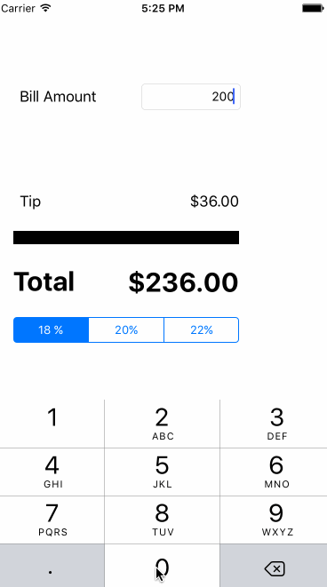

# Tip Calculator applications - iOSfor Designers/PMs

This application is a barebones tip calculator built using the vimeo walkthru. I spent around 4 hours for the entire exercise 

## What does the app do?

* [x] Required: The user can calculate the tip, using diferent percentages using the app

Demo of the tip calculator app for ios:

## What did I miss?

* [ ] No additional features: I was able to complete only the tutorial on Vimeo. I need to better it with some more features
* [ ] Layout and colors: Layout could be better and I need to play around with the colors 
* [ ] The code has some warnings on using let instead of var. Googled about the error, but did not have time to see how to eliminate the warnings and still keep var
 
The GIF was created with [LiceCap](http://www.cockos.com/licecap/).
